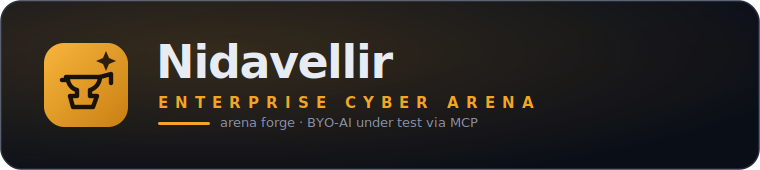
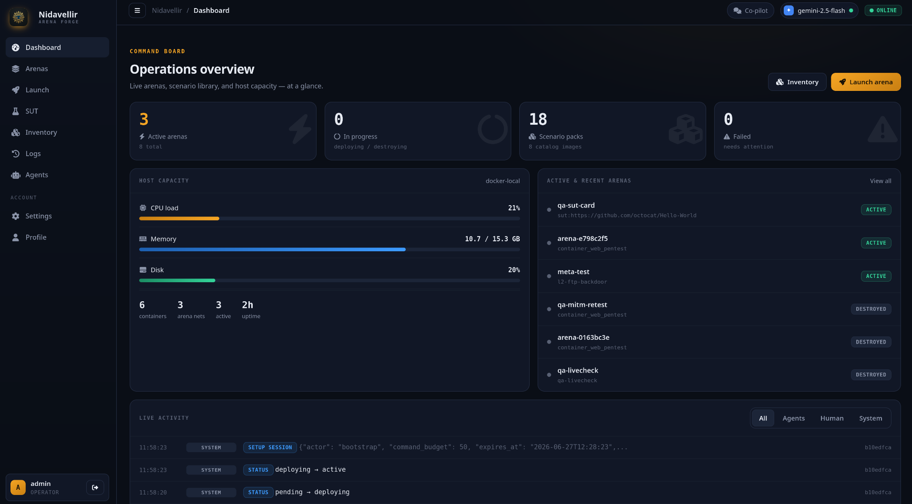
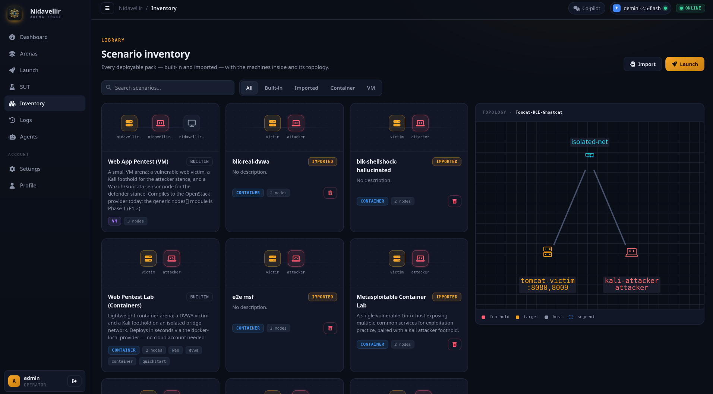
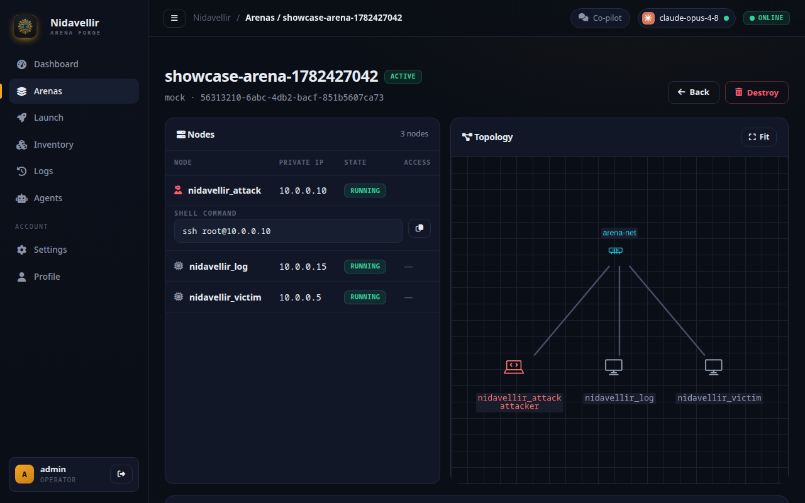

<p align="center">
  
</p>

<p align="center">
  <b>An agentic arena forge for testing skills in dynamic environments — and, above all, for testing AI agents.</b><br>
  Provision arbitrary multi-machine vulnerable topologies on demand and expose them, through
  <b>MCP gateways</b>, to bring-your-own agents placed as <b>attacker</b>, <b>MITM</b>, or <b>defender</b>.
</p>

<p align="center">
  <a href="https://gianlucabassani.github.io/Nidavellir"><strong>Explore the Live Website & Interactive Docs »</strong></a>
</p>

<p align="center">
  <a href="https://gianlucabassani.github.io/Nidavellir"></a>
  
  
  
  
</p>

---

Humans (operators) author and run engagements; **the AI is the system under test**. Every agent
is **bring-your-own** — connected via MCP under the operator's own key and model — and every
action flows through a gateway that enforces **scope**, applies **guardrails**, meters **per-key
budgets**, and writes an **append-only audit trace**. The whole stack runs on a laptop (Docker),
on OpenStack, or on AWS.

> **AI-centered, never AI-required.** Built for testing AI agents and MCP-compliant throughout,
> but every arena stays fully drivable by a human pentester with no model in the loop.

## The console

<p align="center"></p>

A mission-control dashboard: live arenas, host capacity, and a source-split activity stream
(agent / human / system) at a glance. The **Inventory** shows every scenario pack with the
machines inside it and a live topology preview:

<p align="center"></p>

The **Arena View** gives operators full live-control over active topologies:

<p align="center"></p>

## Three pillars

1. **Dynamic N-node topologies** (GOAD-inspired). A scenario is a provider-agnostic, data-defined
   topology — arbitrary `nodes[]` + network `segments[]`, not a frozen trio. One spec compiles to
   docker-local containers, OpenStack VMs, or AWS. Ships as **arena packs** with variants.
2. **Agent runtime via MCP gateways** *(the priority)*. A BYO agent connects only through a gateway
   that wires it into a running arena as **attacker** (offensive foothold, scored), **MITM**
   (in-path on a shared segment), or **defender** (blue: events, alerts, response) — with scope
   enforcement, guardrails, budgets, and traces. Multiple agents can share one arena (red-vs-blue).
3. **Zero-to-prompt scenario generation** (BYO key). An LLM turns a brief into a topology spec;
   Nidavellir **validates** it against the schema and **compiles** it — never auto-deploying
   unreviewed infra.

The data model scales to new arena *kinds* cheaply — AD labs, service meshes, CTF web apps,
LLM-app targets, and **software-under-test (SUT) arenas**: point Nidavellir at any open-source
project and have a BYO agent pentest it, white- or black-box, deeply monitored and scored.

## Quick start

No cloud account needed — the dev stack runs everything in Docker, mock mode pinned:

```bash
docker compose -f docker-compose.yml -f docker-compose.dev.yml up -d --build
# Console: http://localhost:5000   (login: admin / nidavellir)
# API:     http://localhost:8000   (header: X-API-Key: dev-insecure-key)
```

To run **real container arenas** on the local Docker daemon, set `RANGE_PROVIDER=docker-local`
and `MOCK_MODE=false` on the worker (see `docker-compose.dev.yml`). For OpenStack/AWS, configure
the provider credentials and flip `MOCK_MODE=false`.

Import a ready-to-run target from [Vulhub](https://github.com/vulhub/vulhub) (container CVE
environments) in one call:

```bash
curl -sX POST localhost:8000/scenarios/import/vulhub -H "X-API-Key: dev-insecure-key" \
  -H 'Content-Type: application/json' -d '{"path":"log4j/CVE-2021-44228"}'
```

## Architecture

```
┌────────────┐   HTTP    ┌──────────────┐   tasks    ┌─────────────┐   provider   ┌──────────────┐
│  Console   │ ───────▶ │ Orchestrator │ ───────▶  │   Worker    │ ──────────▶ │ docker-local │
│  (Flask)   │ ◀─────── │ (FastAPI)    │ ◀── Redis │  (Celery)   │   drivers    │ OpenStack/AWS│
└────────────┘           └──────┬───────┘            └─────────────┘              └──────────────┘
       ▲                        │ append-only events · API-key auth · Fernet-at-rest
       │ MCP gateway            ▼
  BYO agent  ─────────▶  attacker / MITM / defender stances  ·  scope · guardrails · budgets · trace
```

- **Console** (Flask + Jinja) — fleet, launch, inventory, logs, agents, configurator, co-pilot.
- **Orchestrator** (FastAPI) — `/deploy`, `/scenarios`, `/exec`, scoring; API-key auth (ADR-0002),
  append-only `events` audit table, Fernet-encrypted outputs at rest.
- **Worker** (Celery + Redis) → **provider drivers** (`mock`, `docker-local`, `openstack`, `aws`).
- **MCP agent gateway** — the BYO-AI seam; stance-scoped toolset + guardrails + JSONL trace.

## Roadmap

Re-sequenced (2026-07-01) around the **software-under-test vertical** — *point Nidavellir at
any repo → stand it up reliably → monitor it deeply → score a bring-your-own agent that
pentests it*. The scenario generator, SUT arenas, configurator and co-pilot already shipped;
M1–M3 **deepen** them into the spine. Full detail (with the state-of-the-art we align to) in
[`ROADMAP.md`](ROADMAP.md).

| Milestone | Focus | Status |
|------|-------|--------|
| **M1** | Reliable *repo → running-service* provisioning (buildpacks-first + verified LLM Dockerfile synthesis) | 🟡 SUT clone + white-box mount + gated source-build ✅; repo-introspection + buildpacks + verified loop ◻ |
| **M2** | Deep monitoring + crash oracle + structured scoring | 🟡 vuln-manifest + findings ✅; monitor sidecar + deterministic validators + partial credit ◻ |
| **M3** | Benchmark & eval layer (traces → datasets, replay) | ◻ planned — model+scaffold+cost rows, OTel/OpenInference traces, ATT&CK/ATLAS/OWASP tagging |
| **M4** | MCP gateway hardening & multi-agent | 🟡 gateway + stances + key↔arena binding + per-arena pause ✅; OAuth 2.1, concurrency, tool defenses, higher-level tools ◻ |
| **M5** | Console, browser access & the no-AI human path | 🟡 mission-control console + co-pilot + topology preview ✅; SSE, in-browser terminal/VNC, pack library ◻ |
| **M6** | LLM-application-as-target arenas (OWASP LLM / Agentic Top 10) | ◻ planned |
| **M7** | Purple-team paired telemetry & detection scoring | ◻ planned |
| **M8** | Hardening & multi-provider hosting (RBAC / SSO / AWS) | ◻ planned — deferred until the M1–M3 spine lands |

## Documentation

Visit the **[Nidavellir Live Website & Interactive Docs](https://gianlucabassani.github.io/Nidavellir)** to browse the codebase documentation in a clean, interactive single-page app.

Individual markdown documents:
- [`docs/OPERATIONS.md`](docs/OPERATIONS.md) — detailed setup & operations
- [`docs/API.md`](docs/API.md) — orchestrator REST API
- [`docs/SCENARIOS.md`](docs/SCENARIOS.md) — the v3 scenario schema + Vulhub import
- [`docs/SECURITY.md`](docs/SECURITY.md) — threat model & containment
- [`docs/adr/`](docs/adr/) — architecture decision records
- [`CONTRIBUTING.md`](CONTRIBUTING.md) · [`ROADMAP.md`](ROADMAP.md)

## License

MIT.
